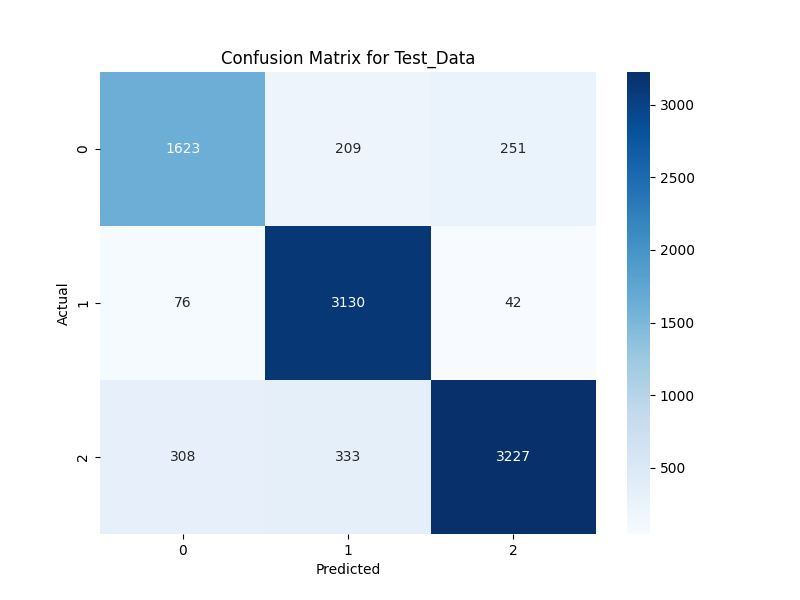

# YouTube Comment Sentiment Analysis Chrome Plugin

This project implements a **Chrome extension** that performs **sentiment analysis** on YouTube video comments in real-time. Using **37K Reddit comments** as a training dataset, the plugin classifies comments into **positive (1)**, **neutral (0)**, and **negative (-1)** categories and visualizes the results for user insights. Extensive text preprocessing, model experimentation, and hyperparameter tuning were conducted to maximize accuracy while addressing class imbalance. 

## Table of Contents
- [Project Overview](#project-overview)
- [Features](#features)
- [Data Collection and Preprocessing](#data-collection-and-preprocessing)
- [Modeling](#modeling)
- [Pipeline and Experiment Tracking](#pipeline-and-experiment-tracking)
- [Deployment](#deployment)
- [Installation](#installation)
- [Usage](#usage)
- [Future Enhancements](#future-enhancements)
- [Acknowledgements](#acknowledgements)

## Project Overview
The Chrome extension analyzes YouTube comments to provide **sentiment scores** by calling a Flask API. **MLflow** and **DagsHub** track all experiments, and **DVC** structures the pipeline stages for easy reproducibility. The model pipeline is containerized and hosted on **AWS** for scalability and robustness.

This project is divided into two repositories for easier management and development:

1. **[Model & API Development Repository](https://github.com/im-vishal/yt-comment-analyzer-plugin.git)**: Contains code for model training, API deployment, and data pipeline setup.
2. **[Chrome Plugin Development Repository](https://github.com/im-vishal/yt-chrome-plugin-frontend.git)**: Contains code for the Chrome extension that utilizes the API for sentiment analysis on YouTube comments.


## Features
- **Real-time Sentiment Analysis**: Categorizes YouTube comments into *Positive*, *Neutral*, and *Negative*.
- **Extensive Model Evaluation**: Uses comprehensive metrics for precision, recall, and f1-score.
- **Imbalance Handling**: Tackles data imbalance through multiple techniques, achieving optimal recall and precision.
- **Result Visualization**: Generates charts to visualize sentiment distribution.
- **Scalable Architecture**: Dockerized deployment on AWS with load balancing.

## Data Collection and Preprocessing
- **Data Source**: 37K Reddit comments labeled in three categories: **Positive (1)**, **Neutral (0)**, and **Negative (-1)**.
- **Target Column**: `category` contains the sentiment labels.
- **Preprocessing**: 
  - Removed special characters, lowercased text, removed stop words.
  - Applied `CountVectorizer` and **TF-IDF** (with unigram, bigram, and trigram variants).

## Modeling
A baseline model was created with `CountVectorizer` and **Random Forest**, yielding **64% accuracy** but with low recall for negative comments due to class imbalance. Several approaches were tried to improve model performance:
- **Imbalance Correction Methods**: Oversampling, **ADASYN**, undersampling, **SMOTE-ENN**.
- **Text Representations**: Bag-of-Words, TF-IDF (uni-, bi-, and trigrams).
- **Models**: Random Forest, **LightGBM**, XGBoost, SVM, Naive Bayes, Logistic Regression.
- **Hyperparameter Tuning**: Used **Optuna** for optimal parameters.

The final model, a **LightGBM** with trigram TF-IDF, achieved the following metrics on the test set:

| Metric           | Negative (-1) | Neutral (0) | Positive (1) | Weighted Avg |
|------------------|---------------|-------------|--------------|--------------|
| **Precision**    | 0.81          | 0.85        | 0.92         | 0.87         |
| **Recall**       | 0.78          | 0.96        | 0.83         | 0.87         |
| **F1-score**     | 0.79          | 0.90        | 0.87         | 0.87         |

The **macro average** F1-score of **85.7%** demonstrates effective handling of the class imbalance problem.

### Confusion Matrix for Best Model


## Pipeline and Experiment Tracking
The model pipeline is organized using **DVC** with the following stages:
1. `data_ingestion`
2. `data_preprocessing`
3. `model_building`
4. `model_evaluation`
5. `model_registration`

**MLflow** logs all experiments, allowing easy access to model performance history.

## Deployment
1. **Flask API**: The Chrome extension queries a **Flask API** to process YouTube comments and classify their sentiment.
2. **Visualization**: Generates visualizations summarizing the sentiment analysis.
3. **Docker**: The model and Flask API are containerized.
4. **AWS Hosting**: Hosted on **AWS** with a **load balancer** to ensure scalable and resilient access.

## Installation
1. **Clone the Repository**:
   ```bash
   git clone https://github.com/im-vishal/yt-comment-analyzer-plugin.git
   cd yt-comment-analyzer-plugin

   git clone https://github.com/im-vishal/yt-chrome-plugin-frontend.git
   cd yt-chrome-plugin-frontend
## Usage
1. **Enable Developer Mode in Chrome:** Open `chrome://extensions/`, enable Developer Mode, and load the unpacked extension.
2. **Analyze Comments:** When on a YouTube video page, the plugin automatically fetches comments and displays sentiment analysis results.
3. **Charts:** Review charts to understand the overall sentiment of the comments.
## Future Enhancements
- **Additional Data Sources:** Incorporate data from other platforms to diversify sentiment analysis.
- **Other Language Comments:** Currently it can read recoginze only english comments as it is not trained on any other language comments.
- **Real-time Model Updates:** Implement a system for periodically retraining the model with fresh data.
- **Advanced Visualizations:** Explore more detailed graphical representations of sentiment trends.
## Acknowledgements
Special thanks to **Reddit** for the dataset and **DVC**, **MLflow**, **Optuna**, and **AWS** for providing the tools used to make this project possible.

## Other CMDs
- pipreqs . --force
- docker build -t virtualvishal/yt-comment-analysis .
- docker run -p 8888:5000 -e DAGSHUB_PAT=c52d45d06347759d028fabbb3cc57e53cf6d5a33 virtualvishal/yt-comment-analysis
- 

#!/bin/bash

# Update the package list
sudo apt-get update -y

# Install Ruby (required by the CodeDeploy agent)
sudo apt-get install ruby -y

# Download the CodeDeploy agent installer from the correct region
wget https://aws-codedeploy-ap-south-1.s3.ap-south-1.amazonaws.com/latest/install

# Make the installer executable
chmod +x ./install

# Install the CodeDeploy agent
sudo ./install auto

# Start the CodeDeploy agent
sudo service codedeploy-agent start
